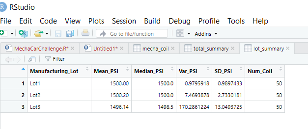

# MechaCar Statistical Analysis:  R Programming
## Module 15

## Overview of Project
The AutosRUs’ newest prototype, the MechaCar, is suffering from production troubles that are stopping the manufacturing team’s from attaining production targets. Data analytics were performed on the production data for insights that may help the manufacturing team and AutosRUs’ upper management identify and target those issues.
In this challenge, data analytics performed the following:

•	Perform multiple linear regression analysis to identify which variables in the dataset predict the mpg of MechaCar prototypes

•	Collect summary statistics on the pounds per square inch (PSI) of the suspension coils from the manufacturing lots

•	Run t-tests to determine if the manufacturing lots are statistically different from the mean population

•	Design a statistical study to compare vehicle performance of the MechaCar vehicles against vehicles from other manufacturers. For each statistical analysis, you’ll write a summary interpretation of the findings.

This assignment consisted of three technical analysis deliverables and a proposal for further statistical study;

1.	Linear Regression to Predict MPG
2.	Summary Statistics on Suspension Coils
3.	T-Test on Suspension Coils
4.	Design a Study Comparing the MechaCar to the Competition

##  1. Linear Regression to Predict MPG

The MechaCar_mpg.csv dataset contains mpg test results for 50 prototype MechaCars. The MechaCar prototypes were produced using multiple design specifications to identify ideal vehicle performance. Multiple metrics, such as vehicle length, vehicle weight, spoiler angle, drivetrain, and ground clearance, were collected for each vehicle. Using R, a linear model that predicts the mpg of MechaCar prototypes using several variables from the MechaCar_mpg.csv file was deleloped.  All of the following data analysis code can be seen in the Rscript  "MechaCarChallenge.RScript."

An RScript is written for a linear regression model to be performed on all six available variables

and can be seen in Figure 1

  

 The Resulting Model formula is 

mpg = (6.267)vehicle_length + (0.0012)vehicle_weight + (0.0688)spoiler_angle + (3.546)ground_clearance + (-3.411)AWD + (-104.0)

as can be seen in Figure 2

  

### Summary: From the shown output it can be observed that:
The vehicle length, and vehicle ground clearance are statistically more likely to provide non-random amounts of variance to the model than othet variables and therefore have a more significant impact on miles per gallon (mpg) on the MechaCar prototype. The vehicle weight, spoiler angle, and All Wheel Drive (AWD) have p-Values that indicate random amounts of variance with the dataset.
The p-Value for this model of 5.35e-11, is much smaller than the generaly accepted significance level of 0.05%. This indicates there is sufficient evidence to reject our null hypothesis that mpg is not affected .  This linear model has an r-squared value of 0.7149, which means that approximately 71% of all mpg predictions will be determined correctly by this model.  

##  2. Summary Statistics on Suspension Coils

The MechaCar Suspension_Coil.csv dataset contains the results from multiple production lots. The weight capacities of multiple suspension coils were tested to determine if the manufacturing process is consistent across production lots. A summary of this dataset statistics is shown in the following figures

Figure 3 shows how the data was incorporated into R session as an object table

  

The suspension coil’s PSI continuous variable across all manufacturing lots.
The following PSI metrics for each lot: mean, median, variance, and standard deviation is shown in the generated summary table shown in Figure 4

  

The variance measures the average degree to which each point differs from the mean, in this case the dataset displays a Variance of ~62.3.
While Standard deviation is the spread of a group of numbers from the mean and is caculated to be 7.89 in this case.  The Mean and the Median are pretty close to each other at 1498.78 and 1500 respectively. 
A RScript that creates a lot_summary dataframe that summarises the mean, median, variance, and standard deviation of the suspension coil’s PSI column by manufacturing lot. The Statistical summary can be seen in Figure 5

  

in Contrast the statistical values of the PSI data by manufacturing lot show a larger disparity in values. As seen in Figure 5

The Suspension Coil dataset provided for the MechaCar contains the results of testing the weight capacities of multiple suspension coils from multiple production lots to determine consistency. The variance measures the average degree to which each point differs from the mean, in this case the dataset displays a Variance of ~62.3.
While Standard deviation is the spread of a group of numbers from the mean and is caculated to be 7.89 in this case.  The Mean and the Median are pretty close to each other as well at 1498.78 and 1500 respectively.

With the understanding that the design specifications for the MechaCar suspension coils mandate that the variance of the suspension coils cannot exceed 100 pounds per square inch (PSI) .  The current manufacturing data meet this design specification for all manufacturing lots in total meats the design specifications.  

However, each lot individually, shows disparity in variance and standard deveation demostrating that there is not consistency in coil production for all 3 manufactoring lots.  In particular the variance of lot 3 is 170.29 PSI which is well above the 100 PSI variance requirement.

Lot 1 and Lot 2 are well within the 100 PSI variance requirement; with variances of 0.98 and 7.47 respectively. 

It can then be assumed that Lot 3 that is disproportionately causing the variance at the full lot level.

##  3.  t-Tests on Suspension Coils
The performance of t-tests was conducted to determine if all manufacturing lots and each lot individually are statistically different from the population mean of 1,500 pounds per square inch shown previously.

The RScript using the t.test() function to determine if the PSI across all manufacturing lots is statistically different from the population mean of 1,500 pounds per square inch was written and the results demonstrated that for the total population a mean value of 1498.78 PSI is consisted with previous results.  Results shown in Figure 6

  

Three more RScripts in the MechaCarChallenge.RScript using the t.test() function on subsets of for each manufacturing lot is statistically different from the population mean of 1,500 pounds per square inch. Shown in Figure 7

  

The results of the t Test analysis shown that the true means for each lot is consistent with the overall population mean of 1,500 PSI.  Furthermore,  with a p-Value of 0.06, which is higher than the common significance level of 0.05, there is NOT enough evidence to support rejecting the null hypothesis.  All t-tests yield a 95% confidence interval.

	However, Lot 3, the sample mean is 1496.14 and the p-Value is 0.04, which is lower than the significance level of 0.05. All indicating to reject the null hypothesis that this sample mean and the presumed population mean are not statistically different.
Therefore it can be assumed that Lot3 production process needs to be checked and the suspension coils from this lot need to be inspected morecarefully to meet quality control.

## 4.  Study Design: MechaCar vs Competition

The following is a suggested design for a statistical study, to be similarly developed in R, to compare performance of the MechaCar vehicles against performance of vehicles from other manufacturers.

The statistical study design would have the following:

###  Metrics
Collecting data for comparable models across all major manufacturers for past 3 years for the following metrics:

•	Engine Type (Electric, Hybrid, Gasoline / Conventional): Dependent Variable

•	HP (Horse Power): Independent Variable

•	cly (Cylinders): Independent Variable

•	Trans (transmission): Independent Variable

•	AWD (All Wheal Drive): Independent Variable

•	Safety Feature Rating: Independent Variable

•	Environmental Impact Rating: Independent Variable

•	Fuel/Energy cost reduction: Independent Variable

###  Hypothesis: Null and Alternative
After determining which factors are key for the MechaCar's genre:

•	Null Hypothesis (Ho): MechaCar Engine Type selection (production focus) based on its performance of key factors for its genre.

•	Alternative Hypothesis (Ha): MechaCar engine type selection is NOT correctly based on performance of key factors for its genre.

### Statistical Tests
A multiple linear regression would be used to determine the factors that have the highest correlation/predictability with the Engine Type Selection (dependent variable); which combination has the greatest impact on Engine Type selection (marketability/production demand).

